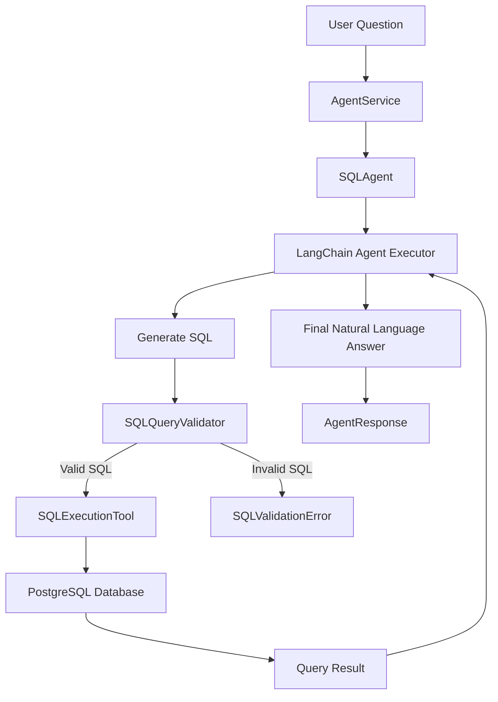

# KIVI RAG LangChain

A local-first, test-driven SQL agent project using **Python**, **LangChain**, **PostgreSQL**, and **Ollama**.

The goal is to build a smart database assistant that can answer user questions by inspecting a SQL database, generating safe SQL queries, executing them, and explaining the results in natural language.

This project does **not** try to rebuild LangChain from scratch.  
Instead, it uses existing LangChain components where they are strong, while adding a controlled, object-oriented, testable application layer around them.

---

## Core Idea

We want a local AI agent that can:

1. Receive a natural-language question.
2. Inspect available database schema information.
3. Decide which SQL query is needed.
4. Validate the generated SQL before execution.
5. Execute only safe SQL against the database.
6. Return a useful answer to the user.
7. Optionally expose intermediate SQL queries and reasoning steps for debugging.

The system should be safe, modular, testable, and easy to extend.

---

## Technology Stack

- **Python** for application code.
- **LangChain** for SQL-agent functionality and tool orchestration.
- **LangChain Community** for `SQLDatabase`.
- **LangChain Ollama** for local model integration.
- **Ollama** for local LLM inference.
- **PostgreSQL** as the primary database target.
- **SQLAlchemy / psycopg** for database connectivity.
- **pytest** for unit testing.

---

## Design Philosophy

This project follows three major principles:

### 1. Use Existing Tools Where Appropriate

LangChain already provides useful building blocks for SQL agents, including:

- SQL database abstraction
- SQL toolkit utilities
- tool-based agent execution
- prompt integration
- LLM abstraction

We use those components instead of recreating them.

However, raw SQL agents can be risky because language models may generate destructive, invalid, or overly broad SQL.

Therefore, our own code adds guardrails around LangChain.

---

### 2. Build a Controlled Application Layer

Our application layer is responsible for:

- validating generated SQL
- enforcing read-only behavior
- wrapping database access
- wrapping Ollama model creation
- defining clear response objects
- handling errors consistently
- making components independently testable
- keeping prompts version-controlled
- making future extensions easier

The agent should not directly execute arbitrary model-generated SQL without passing through our validation layer.

---

### 3. Red-Green-Refactor Development

We follow the **Red-Green-Refactor** workflow:

1. **Red**: Write a failing unit test first.
2. **Green**: Implement the smallest amount of code needed to pass.
3. **Refactor**: Improve structure while keeping tests green.

This keeps the project safe, incremental, and maintainable.

---

## Planned Architecture

The project is organized around small, focused classes.

```text
src/
└── deep_sql_agent/
    ├── __init__.py
    ├── exceptions.py
    ├── sql_validation.py
    ├── database.py
    ├── models.py
    ├── schema.py
    ├── tools.py
    ├── prompts.py
    ├── agent.py
    └── service.py

tests/
├── test_sql_validation.py
├── test_database.py
├── test_models.py
├── test_schema.py
├── test_tools.py
├── test_prompts.py
├── test_agent.py
└── test_service.py
```

---

## Component Responsibilities

### `exceptions.py`

Defines project-specific exception classes.

Examples:

- `AgentError`
- `DatabaseError`
- `ModelError`
- `SQLValidationError`

The goal is to avoid leaking low-level library errors directly through the application.

---

### `sql_validation.py`

Contains SQL safety checks.

Primary responsibility:

- reject empty SQL
- reject non-string input
- reject multiple statements
- reject destructive SQL
- enforce read-only mode
- raise `SQLValidationError` when unsafe SQL is detected

This is the first component implemented because it is safety-critical and easy to test independently.

---

### `database.py`

Wraps LangChain database creation.

Primary responsibility:

- create a LangChain `SQLDatabase`
- validate database URI configuration
- test basic database connectivity
- wrap connection errors in `DatabaseError`

This keeps database setup isolated from the rest of the agent.

---

### `models.py`

Creates local Ollama model objects.

Primary responsibility:

- configure `ChatOllama`
- configure optional embedding models if needed later
- validate model settings
- centralize Ollama base URL and model names

This lets us swap local models without rewriting the agent logic.

---

### `schema.py`

Provides database schema context.

Primary responsibility:

- list available tables
- fetch table schema information
- build compact schema descriptions for prompts
- optionally limit which tables the agent can access

This prevents the agent from needing unrestricted or unclear schema access.

---

### `tools.py`

Defines safe SQL execution tools.

Primary responsibility:

- wrap LangChain SQL tools
- validate SQL before execution
- execute SQL only after validation
- return clean tool output
- optionally record generated SQL queries

This is where our SQL safety layer connects to LangChain’s agent tooling.

---

### `prompts.py`

Stores prompt templates.

Primary responsibility:

- define system instructions
- enforce read-only behavior in the prompt
- instruct the model to use only database-derived information
- define output expectations
- keep prompts version-controlled and testable

Prompts are treated as application code, not as ad-hoc strings hidden inside functions.

---

### `agent.py`

Builds and runs the SQL agent.

Primary responsibility:

- combine LLM, tools, and prompts
- invoke the LangChain agent
- capture intermediate steps
- normalize the result into an `AgentResponse`

This module should not know low-level database connection details.

---

### `service.py`

Acts as the composition root.

Primary responsibility:

- assemble database connector
- assemble model factory
- assemble schema provider
- assemble tools
- assemble prompt builder
- assemble agent
- expose a simple `answer(question: str)` method

This is the main high-level entry point for application use.

---

## High-Level Flow



---

## Safety Goals

The agent should be treated as potentially unsafe by default.

Therefore, the project should enforce:

- read-only SQL by default
- no `DROP`
- no `DELETE`
- no `UPDATE`
- no `INSERT`
- no `ALTER`
- no `TRUNCATE`
- no `CREATE`
- no multiple SQL statements
- no direct execution without validation

Future improvements may include:

- SQL parsing with a dedicated parser
- table allowlists
- column allowlists
- row limits
- query timeout limits
- audit logging
- query explanation before execution

---

## Development Roadmap

### Phase 1: Foundation

- [x] Create project structure
- [x] Add `exceptions.py`
- [x] Add `sql_validation.py`
- [x] Add tests for SQL validation
- [ ] Add `database.py`
- [ ] Add tests for database connector

### Phase 2: LangChain Integration

- [ ] Add Ollama model factory
- [ ] Add schema provider
- [ ] Add safe SQL execution tool
- [ ] Add prompt builder
- [ ] Add SQL agent wrapper

### Phase 3: End-to-End Agent

- [ ] Build `AgentService`
- [ ] Add integration-style tests with mocked LangChain components
- [ ] Add local manual test script
- [ ] Connect to a real PostgreSQL database
- [ ] Run with local Ollama model

### Phase 4: Hardening

- [ ] Add table allowlist
- [ ] Add query timeout handling
- [ ] Add structured logging
- [ ] Add generated SQL trace output
- [ ] Add configurable maximum result size
- [ ] Add better SQL parsing
- [ ] Add CLI or web interface

---

## Testing Strategy

Every meaningful component should have a matching test file.

Examples:

```text
src/deep_sql_agent/sql_validation.py
tests/test_sql_validation.py

src/deep_sql_agent/database.py
tests/test_database.py

src/deep_sql_agent/models.py
tests/test_models.py
```

External dependencies such as PostgreSQL, Ollama, and LangChain agent execution should be mocked in unit tests whenever possible.

Live integration tests can be added separately later.

---

## Running Tests

Install dependencies:

```bash
pip install -r requirements.txt
```

Run tests:

```bash
pytest
```

If needed, explicitly set the Python path:

```bash
PYTHONPATH=src pytest
```

---

## Current First Milestone

The first milestone is to build a safe SQL validation layer.

The validator should answer the question:

> “Is this SQL query safe enough to execute?”

Only after this layer is tested and stable should we connect it to LangChain tools.

---

## Why This Project Exists

LangChain can already create SQL agents.

But this project exists because production-like SQL agents need more than basic agent execution.

They need:

- safety
- predictable behavior
- testability
- controlled database access
- clear module boundaries
- local model support
- maintainable architecture

This repository provides that application layer.